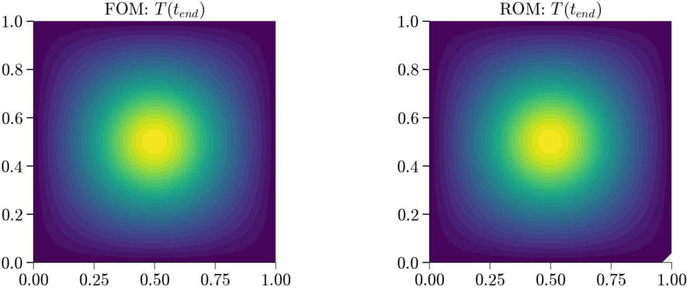

{fig-align="center" width="80%"}

## Problem Setup
[Link](https://github.com/suparnob100/scikit-rom/tree/main/examples/heat_transfer/dynamic/problem_transient_heat_2d)

{width="85%" height="1000px"}

