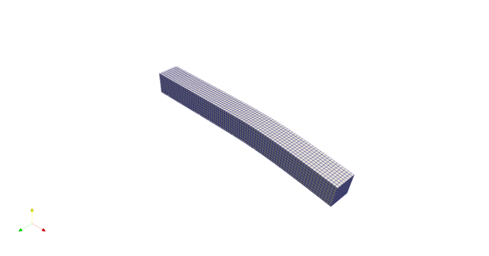

{fig-align="center"}

## **Problem Setup**

[Link](https://github.com/suparnob100/scikit-rom/tree/main/examples/computational_mechanics/static/linear/problem_1)

[See detailed tutorial for this problem](P3_tutorial.qmd)

{width="85%" height="1000px"}