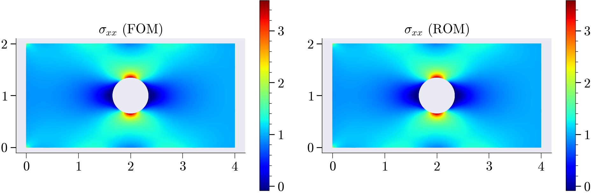

{fig-align="center" width="100%"}

## Problem Setup

[Link](https://github.com/suparnob100/scikit-rom/tree/main/examples/computational_mechanics/static/linear/problem_2)

{width="85%" height="1000px"}
