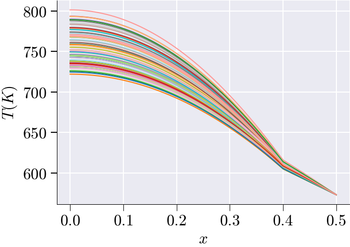

{fig-align="center"}

This tutorial presents the complete workflow for building a reduced-order model (ROM) of a parametric, nonlinear, steady-state heat conduction problem in a one-dimensional two-material rod using scikit-rom. The rod is partitioned into two regions with distinct, temperature-dependent thermal properties, making the governing equation fully nonlinear. The files define the mesh, boundary conditions, piecewise nonlinear material laws and their derivatives, the Newton–Raphson residual and Jacobian forms, Sobol parameter sampling, full-order Newton solves, snapshot mean-subtraction, POD basis construction via SVD, Galerkin ROM projection, and three hyper-reduction strategies (ECSW, ECM, DEIM).


## Problem Description

We analyze a 1-D rod of total length $L = 0.5$ m occupying the interval $\Omega = [0, L]$. The rod is divided at the break-point $x_b = 0.4$ m into two material subdomains:

$$\Omega_1 = [0,\;0.4), \qquad \Omega_2 = [0.4,\;0.5].$$

The steady-state temperature field $T(x)$ (in Kelvin) satisfies the nonlinear boundary value problem

$$-\frac{d}{dx}\!\left[k(T;\,\mu)\,\frac{dT}{dx}\right] = q(T;\,\beta), \qquad x \in (0, L),$$

with boundary conditions

$$\frac{dT}{dx}\bigg|_{x=0} = 0 \quad (\text{Reflective / Neumann BC at the left edge}),$$

$$T(L) = 573.15\ \text{K} \quad (\text{Dirichlet BC at the right edge } x = 0.5\text{ m}).$$

The material coefficients $k(T;\mu)$ and $q(T;\beta)$ depend on the temperature $T$ and on two scalar parameters: the conductivity offset $\mu \in [-4, 4]$ and the source offset $\beta \in [-1000, 1000]$.

**Nonlinear Parametric Problem**: Because $k$ and $q$ are nonlinear functions of $T$, standard affine decomposition is not applicable. The problem is solved with Newton–Raphson iterations at full-order, and the snapshot data are used to build a nonlinear reduced-order model using POD and hyper-reduction.

**Two Material Regions**: The piecewise nature of the material laws requires region masks at every assembly step so that the correct formula is applied to each element.

**Hyper-Reduction**: Three methods — ECSW (element weights), ECM (Gauss-point weights), and DEIM (interpolation) — are implemented to eliminate the full-mesh assembly cost during online ROM queries.

[Link](https://github.com/suparnob100/scikit-rom/tree/main/examples/heat_transfer/static/non_linear/problem_1_h)


 [Video tutorial](https://www.youtube.com/playlist?list=PLVweTj3PB5sINcUVpPnPp_rJZ6Z2YkbNG)


{width="85%" height="1000px"}


## Project Architecture

The simulation workflow is organized through the following directory structure and files:

```         
problem_1_h/
├─ domain.py           # Mesh generation, P1 basis, DOF identification, region partitioning
├─ bilinear_forms.py   # Newton Jacobian bilinear form J(du, v)
├─ linear_forms.py     # Nonlinear residual form R(v) and RHS form rhs(v)
├─ properties.py       # Piecewise conductivity k(T;μ), source q(T;β), and their derivatives
├─ params.py           # Sobol sampling of (μ, β) for training and testing
├─ problem_def.py      # Main problem class: FOM, ROM, ECSW, ECM, DEIM solvers
└─ problem_1_h.ipynb   # Executes FOM generation, SVD/POD, ROM, hyper-ROM, error reporting
```

## 1. Geometry & Finite Element Framework — domain.py

**Domain and Mesh**: The domain is the interval $[0, 0.5]$. A uniform 1-D mesh is created with $n_x = 2^{14} = 16{,}384$ elements using `MeshLine(np.linspace(0, 0.5, n_x))`. The refinement exponent is `factor = 14`.

**Basis Functions**: The code uses `ElementLineP1()`, giving the standard piecewise-linear (P1) Lagrange basis for the temperature field $T(x)$.

**Boundary Identification**:

-   **Left boundary** ($x = 0$): carries the homogeneous Neumann (reflective) condition; no Dirichlet DOFs are imposed here.
-   **Right boundary** ($x = 0.5$): carries the Dirichlet condition $T = 573.15$ K, identified by `basis.get_dofs(lambda x: np.isclose(x[0], 0.5))`.

**DOF Partitioning**: `dirichlet_boundary_dofs` holds the constrained DOFs at $x = 0.5$. The `free_dofs` are all remaining unconstrained DOFs, obtained via `basis.complement_dofs(dirichlet_boundary_dofs)`.

**Region Partitioning**: The element-centroid coordinates are retrieved using `element2location(mesh)`. The element-level boolean arrays are:

-   `region_1`: elements whose centroids satisfy $x < 0.4$ (Material 1)
-   `region_2`: elements whose centroids satisfy $x \geq 0.4$ (Material 2)

These are packed into `global_mask = tuple(regions_mask.items())` and passed to every assembly call so that the piecewise material functions apply the correct formula to each element. The function returns a dictionary with keys `nx`, `mesh`, `basis`, `free_dofs`, `dirichlet_boundary_dofs`, `dirichlet_boundary_value`, and `global_mask`.

## 2. Material Properties & Coefficient Functions — properties.py

All coefficient functions return both the **value** and the **derivative with respect to $T$**. The derivative is required by the Newton–Raphson Jacobian (see Section 3).

### Thermal Conductivity $k(T;\,\mu)$

The conductivity is piecewise-defined across the two regions:

$$k_1(T;\,\mu) = 16 + \mu + \frac{2150}{T - 73.15}, \qquad x \in \Omega_1,$$

$$k_2(T;\,\mu) = 30 + \mu + 2.09\times10^{-2}\,T - 1.45\times10^{-5}\,T^{2} + 7.67\times10^{-9}\,T^{3}, \qquad x \in \Omega_2.$$

The parameter $\mu$ enters as a uniform additive shift that controls the overall conductivity level in both materials. The derivatives with respect to $T$ are:

$$\frac{\partial k_1}{\partial T} = -\frac{2150}{(T - 73.15)^{2}},$$

$$\frac{\partial k_2}{\partial T} = 2.09\times10^{-2} - 2\times1.45\times10^{-5}\,T + 3\times7.67\times10^{-9}\,T^{2}.$$

### Heat Source $q(T;\,\beta)$

The internal heat generation is also piecewise-defined:

$$q_1(T;\,\beta) = \beta + 35000 + \frac{T}{10}, \qquad x \in \Omega_1,$$

$$q_2(T;\,\beta) = 10\beta + 5000, \qquad x \in \Omega_2.$$

The source in $\Omega_1$ grows linearly with temperature; the source in $\Omega_2$ is constant with respect to $T$. The parameter $\beta$ has a ten-fold amplification in $\Omega_2$. The derivatives are:

$$\frac{\partial q_1}{\partial T} = 0.1, \qquad \frac{\partial q_2}{\partial T} = 0.$$

**Implementation Pattern**: Both `k()` and `q()` accept `global_mask` and `elem_indices` as arguments. When `elem_indices` is not `None` (as in hyper-reduction), the masks are sliced to the active element subset before evaluation, so that only the required element contributions are computed.

## 3. Newton–Raphson Jacobian — bilinear_forms.py

### Variational Formulation

Multiplying the strong-form PDE by a test function $v \in H^1_{0,D}(\Omega)$ and integrating by parts, with the Neumann condition contributing zero flux at $x = 0$, the **nonlinear residual** reads

$$\mathcal{R}(T;\,v) = \int_0^L k(T;\mu)\,\frac{dT}{dx}\,\frac{dv}{dx}\,dx - \int_0^L q(T;\beta)\,v\,dx = 0, \qquad \forall\,v \in V.$$

### Linearisation

At Newton iteration $n$, the update $\delta T$ satisfies $\mathcal{J}(\delta T,\,v) = -\mathcal{R}(T^n;\,v)$, where $\mathcal{J}$ is obtained by differentiating $\mathcal{R}$ with respect to $T$ in direction $\delta T$:

$$\mathcal{J}(\delta T,\,v) = \int_0^L \left[ k(T)\,\frac{d(\delta T)}{dx}\frac{dv}{dx} + \frac{\partial k}{\partial T}\,\delta T\,\frac{dT}{dx}\frac{dv}{dx} - \frac{\partial q}{\partial T}\,\delta T\,v \right] dx.$$

The three terms have distinct physical roles:

-   **Term 1** — $\int k(T)\,\nabla(\delta T)\cdot\nabla v\,dx$: standard diffusion stiffness, linearised about the current iterate.
-   **Term 2** — $\int \tfrac{\partial k}{\partial T}\,\delta T\,(\nabla T \cdot \nabla v)\,dx$: sensitivity of the conductivity to the temperature increment.
-   **Term 3** — $-\int \tfrac{\partial q}{\partial T}\,\delta T\,v\,dx$: sensitivity of the source term to the temperature increment.

In `bilinear_forms.py`, the `@BilinearForm`-decorated function `J_form(du, v, p)` evaluates this integrand at every quadrature point, reading `k_val, dk_val` from `k()` and `dq_val` from `q()` via the context dictionary `p`.

## 4. Residual and RHS Forms — linear_forms.py

Two `@LinearForm`-decorated functions are defined in `linear_forms.py`:

**Residual form `R(v, p)`**: Assembles the full nonlinear residual

$$R(v) = \int_0^L k(u)\,\nabla u \cdot \nabla v\,dx - \int_0^L q(u)\,v\,dx,$$

which is the quantity that must equal zero at convergence. This form is used as the right-hand side in the Newton update $\mathbf{J}\,\delta T = -\mathbf{R}$.

**Right-hand-side form `rhs(v, p)`**: Assembles only the source contribution

$$\text{rhs}(v) = \int_0^L q(u)\,v\,dx.$$

This form is used separately within `problem_def.py` (via `f_nl`) when only the source-term vector is needed, for example in certain hyper-reduction assembly pathways.

Both forms read the current solution `u_prev`, the parameters `k_param` and `q_param`, the region masks `global_mask`, and an optional `elem_indices` slice from the context dictionary `p`.

## 5. Parameter Sampling — params.py

**Parameter Ranges**:

-   $\mu$ (`k_param`): $[-4,\;4]$ — conductivity offset
-   $\beta$ (`q_param`): $[-1000,\;1000]$ — source offset

**Sampling Strategy**: The function `parameters(N_snap=32)` uses `generate_sobol` to draw two independent **Sobol low-discrepancy sequences** from the unit square $[0,1]^2$, scaled to $[-4,4]\times[-1000,1000]$. Sobol sequences achieve better space-filling than independent uniform random draws, reducing the number of snapshots required for an accurate ROM.

**Returned Objects**: The function returns four objects:

1.  `params`: combined array of training followed by testing samples, shape `(2*N_snap, 2)`; columns are $[\mu,\,\beta]$.
2.  `param_ranges`: list of bounds `[(-4, 4), (-1000, 1000)]`.
3.  `train_mask`: Boolean array, `True` for the first `N_snap` rows.
4.  `test_mask`: Boolean array, `True` for the last `N_snap` rows (complement of `train_mask`).

In the notebook, `master.fom_simulation(num_snapshots=16)` generates $N_{\text{train}} = 16$ training snapshots, yielding 32 total parameter instances (16 training + 16 testing).

## 6. Problem Orchestration — problem_def.py

**Registered Problem Class**: The class `ProblemNonLinear` inherits from `Problem` and is registered via `@register_problem(PROBLEM_NAME)`, where `PROBLEM_NAME` is derived from the directory name `problem_1_h`.

**Core Interface Methods**:

-   `domain()`: returns `domain_()` from `domain.py`
-   `bilinear_forms()`: returns `[J_form]`
-   `linear_forms()`: returns `[R, rhs]`
-   `properties()`: returns `[k, q]`
-   `parameters(n)`: returns `parameters(n)` from `params.py`
-   `assemble_kwargs(u, param)`: packs `{'u_prev': u, 'k_param': param[0], 'q_param': param[1]}`

### FOM Operator Assembly — `fom_operators()`

On each Newton iteration, `fom_operators()` calls `basis.interpolate(u)` to obtain quadrature-point values of the current temperature field, then calls `asm(self.a, self.basis, **kw)` with the assembled keywords (including `global_mask`). The result is the full-order Jacobian matrix $\mathbf{J}(T^n) \in \mathbb{R}^{N_{\text{dof}} \times N_{\text{dof}}}$.

### FOM Residual Assembly — `fom_rhs()`

Similarly, `fom_rhs()` assembles the full-order residual vector $\mathbf{R}(T^n) \in \mathbb{R}^{N_{\text{dof}}}$ by calling `asm(self.l, self.basis, **kw)`.

### Full-Order Solve — `fom_solver()`

On the first call (`cls.cur_itr == 0`), `load_domain(self)` populates the mesh, basis, DOF arrays, and region masks. The solver then:

1.  Sets a **uniform initial condition** $T^0 = 273.0$ K via `self.u0 = self.basis.zeros() + 273.0`.
2.  Identifies the **Dirichlet DOF indices** as `self.D = self.dirichlet_boundary_dofs.nodal_ix`.
3.  Constrains those DOFs to $T(L) = 573.15$ K throughout all Newton iterations.
4.  Calls `newton_solver(fom_operators, fom_rhs, u0, D, dirichlet_boundary_value, param, tol=1e-2, maxit=50)`.

The Newton iterations solve

$$\mathbf{J}(T^n)\,\delta T^n = -\mathbf{R}(T^n), \qquad T^{n+1} = T^n + \delta T^n,$$

until $\|\mathbf{R}(T^n)\|_2 < 10^{-2}$ or 50 iterations are reached.

### Reduced Operator Projection — `reduced_operators()`

This method bridges the FOM and ROM. Given a current reduced coordinate vector $\boldsymbol{\alpha} \in \mathbb{R}^n$, it first reconstructs the full-order temperature field:

$$T = \bar{T} + \mathbf{U}\,\boldsymbol{\alpha},$$

where $\bar{T}$ (`self.T_ref`) is the training-set mean and $\mathbf{U}$ (`self.U`) is the POD basis matrix of shape $(N_{\text{dof}},\,n)$. It then assembles the full-order Jacobian $\mathbf{J}$ and residual $\mathbf{R}$ at this reconstructed field, and projects onto the subspace:

$$\mathbf{J}_{\text{red}} = \mathbf{U}^{\top}\mathbf{J}(T)\,\mathbf{U} \in \mathbb{R}^{n \times n}, \qquad \mathbf{R}_{\text{red}} = \mathbf{U}^{\top}\mathbf{R}(T) \in \mathbb{R}^{n}.$$

These are the reduced Newton system matrices: $\mathbf{J}_{\text{red}}\,\delta\boldsymbol{\alpha} = -\mathbf{R}_{\text{red}}$.

### Reduced-Order Solve — `rom_solver()`

On the first call, `load_domain(self)` initialises the domain. The ROM state is set:

-   `self.T_ref = cls.train_ref` — the training mean $\bar{T}$
-   `self.U = cls.V_sel` — the POD basis $\mathbf{U}$
-   `self.n_sel = cls.n_sel` — the number of retained modes
-   `self.u0_rom = np.full(n_sel, 500.0)` — **reduced initial guess** (500 K in each mode coordinate)

The method calls `newton_solver_rom(reduced_operators, u0_rom, param, tol=1e-2, maxit=50)`, which iterates in the $n$-dimensional reduced space. Note that the ROM initial guess differs from the FOM initial guess (273.0 K); the hyper-ROM solvers also differ, using `u0 = np.full(n_sel, 273.0)`.

### Hyper-Reduction: ECSW — `hyper_rom_solver_ecsw()`

**Principle**: ECSW (Energy-Conserving Sampling and Weighting) assigns a non-negative scalar weight $z_e \geq 0$ to each element $e$. The weighted element-level assembly approximates the full projected operators:

$$\mathbf{R}_{\text{red}} \approx \mathbf{U}^{\top}\sum_{e:\,z_e > 0} z_e\,\mathbf{R}^{(e)}, \qquad \mathbf{J}_{\text{red}} \approx \mathbf{U}^{\top}\!\left[\sum_{e:\,z_e > 0} z_e\,\mathbf{J}^{(e)}\right]\!\mathbf{U}.$$

The weight vector $\mathbf{z} \in \mathbb{R}^{N_{\text{elem}}}$ is found offline by solving a Non-Negative Least Squares (NNLS) problem trained on the snapshot residuals. The solution is sparse: most $z_e = 0$, and only the active elements (`elem_indices = np.nonzero(weights > 0)`) are visited during online assembly.

**Implementation**: On the first call, `hyper_rom_solver_ecsw()` loads `cls.z` (the element weights), calls `load_domain(self)`, and constructs `LinearFormHYPERROM_ecsw` and `BilinearFormHYPERROM_ecsw` objects. These objects encapsulate the weighted assembly logic. Each Newton step calls `assemble_weighted_ecsw(**kw)` on both objects, reconstructing the full-order field via `reconstruct_solution` before passing it to the assembler.

### Hyper-Reduction: ECM — `hyper_rom_solver_ecm()`

**Principle**: ECM (Empirical Cubature Method) operates at the level of individual **Gauss integration points** rather than whole elements. The weight tensor $\mathbf{z} \in \mathbb{R}^{N_{\text{elem}} \times n_g}_{\geq 0}$ assigns an independent weight to each quadrature point within each element. This provides finer-grained control than ECSW and can achieve higher approximation quality for the same number of active integration points.

The set of active elements is those for which at least one Gauss-point weight is non-zero:

$$\mathcal{E}_{\text{ECM}} = \bigl\{e : \exists\,g\ \text{such that}\ z_{e,g} > 0\bigr\},$$

identified via `np.nonzero(np.any(np.asarray(gauss_weights) > 0, axis=1))`.

**Implementation**: On the first call, `hyper_rom_solver_ecm()` loads `cls.z` (the Gauss-point weight array of shape `(N_elem, n_gauss)`), constructs `LinearFormHYPERROM_ecm` and `BilinearFormHYPERROM_ecm`, and calls `assemble_weighted_ecm(**kw)` at each Newton step.

### Hyper-Reduction: DEIM — `hyper_rom_solver_deim()`

**Principle**: DEIM (Discrete Empirical Interpolation Method) approximates the nonlinear residual vector by evaluating it at a small set of **selected interpolation rows** $\mathcal{I} = \{i_1,\ldots,i_m\}$ and then projecting back to the full space via a precomputed interpolation matrix $\mathbf{P} \in \mathbb{R}^{N_{\text{dof}} \times m}$:

$$\mathbf{R}(T) \approx \mathbf{P}\left(\mathbf{P}_{\mathcal{I}}^{\top}\,\mathbf{P}\right)^{-1}\mathbf{P}_{\mathcal{I}}^{\top}\,\mathbf{R}(T),$$

where $\mathbf{P}_\mathcal{I}$ denotes the rows of $\mathbf{P}$ indexed by $\mathcal{I}$. This is equivalent to computing the residual only at the sampled rows and reconstructing the full residual by interpolation.

**Additional Data**: In addition to the element weights `cls.z`, DEIM requires `cls.sampled_rows` (the selected DOF indices $\mathcal{I}$) and `cls.deim_mat` (the interpolation matrix $\mathbf{P}$), both computed offline from a greedy SVD procedure on residual snapshots.

**Implementation**: On the first call, `hyper_rom_solver_deim()` constructs `LinearFormHYPERROM_deim` and `BilinearFormHYPERROM_deim` with the `sampled_rows` and `deim_mat` arguments. Each Newton step calls `assemble_deim(**kw)`. The Newton solver is called with `alpha=1.0` explicitly.

## 7. Offline Workflow: Building the ROM

The notebook `problem_1_h.ipynb` orchestrates the complete pipeline via Boolean control flags:

| Flag | Default | Action when `True` |
|:-----|:--------|:-------------------|
| `generate_data` | `False` | Re-run FOM Newton solver to produce new snapshots (slow) |
| `visualize` | `True` | Plot temperature fields and parameter scatter |
| `run_svd` | `True` | Compute POD basis via SVD |
| `run_rom` | `True` | Run Galerkin ROM Newton solver |
| `run_hyperrom` | `True` | Run all enabled hyper-ROM solvers |
| `rom_report` | `True` | Print and plot error metrics |
| `_hyperreduce_ecsw` | `True` | Enable ECSW hyper-reduction |
| `_hyperreduce_ecm` | `True` | Enable ECM hyper-reduction |
| `_hyperreduce_deim` | `True` | Enable DEIM hyper-reduction |

**Step-by-step offline process**:

1.  **Environment Setup**: The notebook adds the parent directory to `sys.path`, derives `PROBLEM_NAME` from the folder name, and imports `problem_def.py`. The import triggers `@register_problem`, registering `ProblemNonLinear` with scikit-rom.

2.  **Full-Order Simulation**: If `generate_data=True`, the notebook calls `master.fom_simulation(num_snapshots=16)` and invokes `sim.run_simulation()`. Each of the 16 training parameter instances $(\mu_i, \beta_i)$ is solved by `fom_solver()`, producing the snapshot matrix $\mathbf{T}_{\text{snap}} \in \mathbb{R}^{N_{\text{train}} \times N_{\text{dof}}}$.

3.  **ROM Data Loading**: The notebook creates `rom_data = master.rom_simulation()` to load the stored FOM results, parameter list, and masks from disk.

4.  **Training/Testing Split**:
    - `NLS = np.asarray(rom_data.fos_solutions)` — full snapshot matrix, shape $(32, N_{\text{dof}})$
    - `NLS_train = NLS[train_mask]` — first 16 rows (training snapshots)
    - `NLS_test  = NLS[test_mask]`  — last 16 rows (testing snapshots)
    - `param_list = np.asarray(rom_data.param_list)` — all 32 parameter pairs $[\mu, \beta]$

5.  **Visualization**: If `visualize=True`, temperature profiles $T(x)$ are plotted for all 32 snapshots. A scatter plot shows `param_list[:16]` (training, dark blue) and `param_list[16:]` (testing, orange) in the $(\mu, \beta)$ parameter plane.

6.  **Mean Subtraction**: The training mean is computed and subtracted:

    $$\bar{T} = \frac{1}{N_{\text{train}}}\sum_{i=1}^{N_{\text{train}}} T^{(i)}, \qquad \widetilde{T}^{(i)} = T^{(i)} - \bar{T}.$$

    In code: `NLS_train_mean = np.mean(NLS_train, axis=0)` and `NLS_train_ms = NLS_train - NLS_train_mean`. Centering ensures that the POD modes capture variance rather than the mean state, which is passed separately as `train_ref`.

7.  **SVD / POD Basis Construction**: If `run_svd=True`, `svd_mode_selector(NLS_train_ms, ...)` performs the thin SVD of the mean-subtracted snapshot matrix $\widetilde{\mathbf{T}} \in \mathbb{R}^{N_{\text{train}} \times N_{\text{dof}}}$:

    $$\widetilde{\mathbf{T}} = \mathbf{V}\,\boldsymbol{\Sigma}\,\mathbf{W}^{\top}, \qquad \boldsymbol{\Sigma} = \mathrm{diag}(\sigma_1 \geq \sigma_2 \geq \cdots \geq 0).$$

    The number of retained modes $n$ is chosen by the energy criterion

    $$\frac{\displaystyle\sum_{j=1}^{n}\sigma_j^2}{\displaystyle\sum_{j=1}^{N_{\text{train}}}\sigma_j^2} \geq 1 - \epsilon_{\text{tol}},$$

    returning `n_sel` (the selected mode count), `V_sel` (the POD basis $\mathbf{U} \in \mathbb{R}^{N_{\text{dof}} \times n}$), and `s` (the selected singular values).

## 8. Online Workflow: Fast ROM Evaluation

For each new parameter instance $(\mu^*, \beta^*)$ in the test set, the Galerkin ROM proceeds as follows:

1.  **Initialise ROM Simulation**: `master.rom_simulation(V_sel=V_sel, train_ref=NLS_train_mean)` passes the POD basis and training mean to the ROM controller.

2.  **Set Initial Reduced Coordinates**: `u0_rom = np.full(n_sel, 500.0)`. The reduced Newton iteration begins from this latent-space initial guess.

3.  **Reconstruct Full-Order Field**: At each Newton step, the full-order temperature at the current reduced iterate $\boldsymbol{\alpha}^n$ is recovered as

    $$T^n = \bar{T} + \mathbf{U}\,\boldsymbol{\alpha}^n.$$

4.  **Assemble Full-Order Operators**: $\mathbf{J}(T^n)$ and $\mathbf{R}(T^n)$ are assembled at the full mesh (this is the bottleneck eliminated by hyper-reduction).

5.  **Project onto Reduced Basis**:

    $$\mathbf{J}_{\text{red}} = \mathbf{U}^{\top}\mathbf{J}(T^n)\,\mathbf{U}, \qquad \mathbf{R}_{\text{red}} = \mathbf{U}^{\top}\mathbf{R}(T^n).$$

6.  **Solve Reduced System**: `numpy.linalg.solve` or a similar routine solves the $n \times n$ system $\mathbf{J}_{\text{red}}\,\delta\boldsymbol{\alpha} = -\mathbf{R}_{\text{red}}$, giving the Newton increment in the reduced space.

7.  **Update and Iterate**: $\boldsymbol{\alpha}^{n+1} = \boldsymbol{\alpha}^n + \delta\boldsymbol{\alpha}^n$, repeated until $\|\mathbf{R}_{\text{red}}\| < 10^{-2}$ or 50 iterations.

8.  **Recover Full Solution**: The converged $\boldsymbol{\alpha}^*$ is back-projected to obtain $T^* = \bar{T} + \mathbf{U}\,\boldsymbol{\alpha}^*$.

Because $n \ll N_{\text{dof}}$, steps 5–7 are inexpensive. The bottleneck in the standard ROM is steps 4 (full-mesh assembly), which is addressed by the hyper-reduction methods described below.

## 9. Hyper-Reduction Workflow

All three hyper-reduction solvers are initialised once (on `cls.cur_itr == 0`) and then called for each test parameter. The key differences are summarised below.

**ECSW workflow**:
The offline training solves an NNLS problem to obtain the sparse element weight vector `z`. During online assembly, only the active elements (those with `z[e] > 0`) contribute to the reduced operators. The `assemble_weighted_ecsw` method loops over this reduced element set, scaling each element's contribution by `z[e]`.

**ECM workflow**:
The offline training solves an NNLS problem at the Gauss-point level to obtain `z` of shape `(N_elem, n_gauss)`. During online assembly, `assemble_weighted_ecm` evaluates the integrand at only the Gauss points with positive weight. An element is active if any of its Gauss weights exceeds zero.

**DEIM workflow**:
The offline stage applies a greedy SVD procedure to a collection of residual snapshots, selecting $m$ interpolation indices $\mathcal{I}$ and building the interpolation matrix $\mathbf{P}$. During online assembly, `assemble_deim` evaluates the nonlinear form at the selected DOF rows only, then reconstructs the full residual using $\mathbf{P}$.

| Property | ECSW | ECM | DEIM |
|:---------|:-----|:----|:-----|
| Selection unit | Element | Gauss point | DOF row |
| Weight array shape | $(N_{\text{elem}},)$ | $(N_{\text{elem}},\,n_g)$ | $(N_{\text{elem}},)$ + `deim_mat` |
| Active-set criterion | `weights > 0` | `any(weights > 0, axis=1)` | `weights > 0` |
| Assembly method | `assemble_weighted_ecsw` | `assemble_weighted_ecm` | `assemble_deim` |
| Requires `deim_mat` | No | No | Yes |
| Requires `sampled_rows` | No | No | Yes |
| ROM initial guess | $\boldsymbol{\alpha}^0 = 273.0$ (all modes) | $\boldsymbol{\alpha}^0 = 273.0$ | $\boldsymbol{\alpha}^0 = 273.0$ |
| Newton `alpha` | Default | Default | 1.0 (explicit) |

## 10. Validation and Error Assessment

**Test Set**: The test snapshots `NLS_test = NLS[test_mask]` are the 16 held-out FOM solutions never seen during training.

**Relative Error Metric**: For each test parameter $(\mu_i^*, \beta_i^*)$, the relative $\ell^2$ error between the FOM reference and any reduced approximation is

$$\epsilon_{\text{rel}}(\mu_i^*,\beta_i^*) = \frac{\|T_{\text{FOM}}(\mu_i^*,\beta_i^*) - T_{\text{red}}(\mu_i^*,\beta_i^*)\|_2}{\|T_{\text{FOM}}(\mu_i^*,\beta_i^*)\|_2}.$$

This is computed for all methods (ROM, ECSW, ECM, DEIM) and reported when `rom_report=True`.

**Error Reporting**: The notebook calls `compute_rom_error_metrics_flat(NLS_test, T_rom)` to build an error matrix and `generate_rom_error_report(matrix)` to print a formatted table.

**Diagnostics**: `plot_rom_error_diagnostics_flat()` generates comparison plots of true versus reduced temperature profiles and per-sample relative error bars, together with the speed-up factor over the FOM.

## 11. Summary Table of Key Equations

| Equation | Expression |
|:---------|:-----------|
| Strong-form PDE | $-\frac{d}{dx}[k(T;\mu)\,\frac{dT}{dx}] = q(T;\beta)$ |
| Left BC (Neumann) | $\frac{dT}{dx}\big|_{x=0} = 0$ |
| Right BC (Dirichlet) | $T(0.5) = 573.15\ \text{K}$ |
| Conductivity, $\Omega_1$ | $k_1 = 16 + \mu + 2150\,/\,(T - 73.15)$ |
| Conductivity, $\Omega_2$ | $k_2 = 30 + \mu + 2.09\!\times\!10^{-2}T - 1.45\!\times\!10^{-5}T^2 + 7.67\!\times\!10^{-9}T^3$ |
| $\partial k_1/\partial T$ | $-2150\,/\,(T - 73.15)^2$ |
| $\partial k_2/\partial T$ | $2.09\!\times\!10^{-2} - 2.90\!\times\!10^{-5}T + 2.30\!\times\!10^{-8}T^2$ |
| Source, $\Omega_1$ | $q_1 = \beta + 35000 + T/10$ |
| Source, $\Omega_2$ | $q_2 = 10\beta + 5000$ |
| $\partial q_1/\partial T$, $\partial q_2/\partial T$ | $0.1$,\ \ $0$ |
| Weak residual | $\mathcal{R}(T;v) = \int k\,\nabla T\cdot\nabla v\,dx - \int q\,v\,dx$ |
| Jacobian | $\mathcal{J}(\delta T,v) = \int[k\,\nabla\delta T\cdot\nabla v + \partial_T k\,\delta T\,\nabla T\cdot\nabla v - \partial_T q\,\delta T\,v]\,dx$ |
| Newton update | $\mathbf{J}(T^n)\,\delta T^n = -\mathbf{R}(T^n)$ |
| Snapshot mean | $\bar{T} = \frac{1}{N_{\text{train}}}\sum_i T^{(i)}$ |
| Mean-subtracted snapshot | $\widetilde{T}^{(i)} = T^{(i)} - \bar{T}$ |
| SVD energy criterion | $\sum_{j=1}^{n}\sigma_j^2\,/\,\sum_j\sigma_j^2 \geq 1-\epsilon_{\text{tol}}$ |
| Reduced basis ansatz | $T \approx \bar{T} + \mathbf{U}\boldsymbol{\alpha}$ |
| Reduced Jacobian | $\mathbf{J}_{\text{red}} = \mathbf{U}^{\top}\mathbf{J}\,\mathbf{U}$ |
| Reduced residual | $\mathbf{R}_{\text{red}} = \mathbf{U}^{\top}\mathbf{R}$ |
| ECSW approximation | $\mathbf{R}_{\text{red}} \approx \mathbf{U}^{\top}\sum_{e:\,z_e>0} z_e\,\mathbf{R}^{(e)}$ |
| DEIM approximation | $\mathbf{R} \approx \mathbf{P}(\mathbf{P}_\mathcal{I}^{\top}\mathbf{P})^{-1}\mathbf{P}_\mathcal{I}^{\top}\mathbf{R}$ |
| Relative error | $\epsilon_{\text{rel}} = \|T_{\text{FOM}} - T_{\text{red}}\|_2\,/\,\|T_{\text{FOM}}\|_2$ |

## 12. Summary Table of Key Methods

| Method | Purpose | Pipeline Stage |
|:-------|:--------|:---------------|
| `domain()` | Mesh, P1 basis, DOF identification, region masks | Before any assembly |
| `bilinear_forms()` | Return Newton Jacobian form `J_form` | Operator initialisation |
| `linear_forms()` | Return residual `R` and source `rhs` forms | RHS assembly |
| `properties()` | Return piecewise `k` and `q` with derivatives | Every assembly call |
| `parameters()` | Sobol samples of $(\mu,\beta)$, train/test masks | Data generation |
| `fom_operators()` | Assemble full-order Jacobian $\mathbf{J}$ | Every Newton step (FOM) |
| `fom_rhs()` | Assemble full-order residual $\mathbf{R}$ | Every Newton step (FOM) |
| `fom_solver()` | Newton–Raphson at full mesh resolution | Snapshot generation |
| `reduced_operators()` | Project $\mathbf{J}$ and $\mathbf{R}$ onto POD basis | Every Newton step (ROM) |
| `rom_solver()` | Newton in $n$-dimensional reduced space | Online ROM query |
| `hyper_rom_solver_ecsw()` | Newton with element-weighted assembly | Online ECSW query |
| `hyper_rom_solver_ecm()` | Newton with Gauss-point-weighted assembly | Online ECM query |
| `hyper_rom_solver_deim()` | Newton with DEIM interpolated assembly | Online DEIM query |

## 13. Best Practices

-   Keep the parameter order consistent as $(\mu, \beta)$ across `params.py`, `assemble_kwargs()`, `fom_solver()`, `rom_solver()`, and all hyper-ROM solvers.
-   Pass `global_mask` through `assemble_kwargs` and update it in every operator method with `kw.update({'global_mask': self.global_mask})`.
-   Always subtract the training mean before computing the POD basis; pass `NLS_train_mean` as `train_ref` to the ROM simulation.
-   Keep `generate_data=False` once snapshots are saved; re-running FOM for 16 parameter instances on a $2^{14}$-element mesh is expensive.
-   Use `train_mask` and `test_mask` strictly: never include test samples in the SVD or hyper-reduction training.
-   Verify ROM convergence on the test set (via `rom_report=True`) before enabling hyper-reduction, so that any hyper-reduction error is added on top of a known ROM baseline.
-   Note that the ROM initial guess (`u0_rom = 500.0`) differs from the hyper-ROM initial guess (`u0 = 273.0`); ensure consistency if tuning convergence behaviour.
-   When implementing a new hyper-reduction method, follow the three-stage pattern: (1) load offline data on `cur_itr == 0`, (2) build the hyper-ROM assembly object once, (3) call the weighted assembly at each Newton step.
-   For the DEIM solver, always pass `alpha=1.0` explicitly to `newton_solver_rom` to maintain a full Newton step; damped Newton may be needed for poorly conditioned DEIM approximations.
-   Use the `elem_indices` mechanism in `properties.py` to restrict material evaluations to the active element subset, ensuring that the region masks are correctly sliced for hyper-reduced assembly.